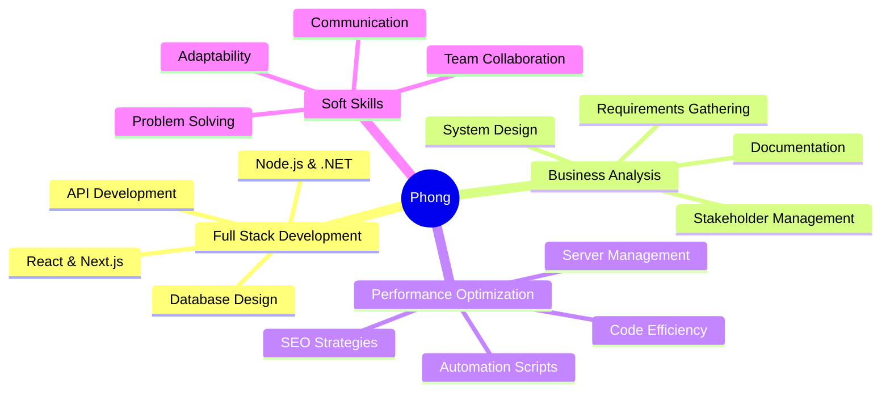

<div align="center">

# 👋 Welcome to My Digital Workspace


<p align="center">
  <a href="https://portfolio-canh-phong.vercel.app/"></a>
  <a href="mailto:nguyencanhphong246@gmail.com"></a>
  <a href="https://github.com/pogonguyen03"></a>
  
</p>

</div>

---

## 🎯 About Me


### 👨‍💻 Who Am I?

Hey there! I'm **Phong** - a passionate Full Stack Developer from **Vietnam** 🇻🇳 who loves turning complex problems into elegant solutions.

🎓 Currently pursuing **Software Engineering** at HUFLIT University (GPA: 3.27/4.0)

💼 Working as a **Full Stack Developer** @ THIEN CO TRI LIEN CO., LTD

🌱 **1+ years** of hands-on experience in international environments

---

### 🚀 What Drives Me

<table>
<tr>
<td width="50%">

#### 💡 My Expertise
- 🎨 Building **scalable web applications**
- 📊 **Business Analysis** & requirement translation
- ⚡ **Performance optimization** for high-traffic systems
- 🤖 **Automation** to boost productivity
- 🛠️ **System architecture** design

</td>
<td width="50%">

#### 🎯 Impact Delivered
- 📈 **1M+** annual visits managed
- 🌐 **1,000+** domains maintained
- 🚀 **99.9%** system uptime
- ⏱️ **40%** time reduction via automation
- 🔄 **Zero** manual entry errors

</td>
</tr>
</table>

---

### 🔥 Current Mission

```javascript
class PhongNguyen extends Developer {
  constructor() {
    super();
    this.name = "Nguyen Canh Phong";
    this.location = "Ho Chi Minh City, Vietnam";
    this.workingOn = "Scalable web solutions & system optimization";
    this.learning = ["Advanced System Design", "Cloud Architecture", "AI/ML Integration"];
    this.interests = ["Clean Code", "Performance Tuning", "Problem Solving"];
  }

  sayHi() {
    console.log("Thanks for visiting! Let's build something amazing together! 🚀");
  }
}

const phong = new PhongNguyen();
phong.sayHi();
```

<div align="center">

### 💼 **Results-Oriented Developer** | 🎓 **Strong BA Foundation** | ⚡ **Performance Optimizer**

[](mailto:nguyencanhphong246@gmail.com)
[](https://github.com/pogonguyen03)

</div>

---

## 🛠️ Tech Arsenal

<details open>
<summary><b>🔥 Languages & Frameworks</b></summary>
<br>

**Backend Powerhouse**
<p>
  
  
  
  
  
  
</p>

**Frontend Excellence**
<p>
  
  
  
  
  
  
  
</p>

**Mobile Development**
<p>
  
  
  
</p>

</details>

<details open>
<summary><b>🗄️ Databases & Infrastructure</b></summary>
<br>

<p>
  
  
  
  
  
  
</p>

</details>

<details open>
<summary><b>🎨 Design & BA Tools</b></summary>
<br>

<p>
  
  
  
  
  
</p>

</details>

<details open>
<summary><b>⚙️ Tools & Platforms</b></summary>
<br>

<p>
  
  
  
  
  
</p>

</details>

---

## 💼 Professional Journey

<table>
<tr>
<td width="50%">

### 🚀 THIEN CO TRI LIEN CO., LTD
**Full Stack Developer** • *Dec 2024 - Present*

```diff
+ Managed 1,000+ domains with 1M+ annual visits
+ Built Python/PHP automation (40% time reduction)
+ Maintained 99.9% uptime for high-traffic systems
+ Optimized WordPress for streaming/novel platforms
```

</td>
<td width="50%">

### 💻 BIT GROUP INVESTMENT JSC
**Web Developer** • *Aug 2024 - Nov 2024*

```diff
+ Designed & developed corporate websites
+ Created custom WordPress themes
+ Enhanced UI/UX and performance optimization
+ Delivered 100% on-time project completion
```

</td>
</tr>
</table>

---

## 🌟 Featured Projects

<div align="center">

### 💍 Digital Wedding Invitation Platform
*Full Stack Developer & System Architect*

<p>
  
  
  
  
</p>

> 🎯 Personalized wedding invitations with unique guest links & automated QR codes
> 
> 📊 Real-time RSVP dashboard using WebSockets for instant host notifications
> 
> ⚡ Efficient event management with scalable architecture

[🔗 View Live Demo](https://wedding-demo.vercel.app)

---

### 🎮 2D RPG Game Engine
*Game Developer*

<p>
  
  
  
</p>

> 🛠️ Custom game engine built from scratch with Advanced OOP
> 
> ⚡ Optimized collision detection for lag-free gameplay
> 
> 🎨 Complex character state management system

</div>

---

## 📊 GitHub Analytics

<div align="center">
  
  
</div>

<div align="center">
  
</div>

<div align="center">
  
</div>

---

## 🏆 Achievements & Metrics

<div align="center">

| 🎯 Metric | 📈 Achievement |
|:---:|:---:|
| **Traffic Managed** | 1M+ visits/year |
| **Domains Maintained** | 1,000+ domains |
| **System Uptime** | 99.9% reliability |
| **Efficiency Gain** | 40% time reduction |
| **Experience** | 1+ years |
| **GPA** | 3.27/4.0 |

</div>

---

## 🎓 Education & Certifications

<div align="center">

🏛️ **HUFLIT University** (2021 - 2025)
<br>
Bachelor of Software Engineering • GPA: 3.27/4.0

🌐 **English Proficiency**
<br>
TOEIC: 570

</div>

---

## 💡 What I Bring to the Table

<div align="center">



</div>

---

## 🔥 Current Focus

<div align="center">

🚀 Building scalable web applications with modern tech stacks
<br>
🎯 Optimizing high-traffic systems for maximum performance
<br>
📚 Learning advanced cloud architecture & AI integration
<br>
💼 Open to exciting opportunities and collaborations

</div>

---

## 📫 Let's Connect!

<div align="center">

<a href="https://portfolio-canh-phong.vercel.app/">
  
</a>
<a href="mailto:nguyencanhphong246@gmail.com">
  
</a>
<a href="https://github.com/pogonguyen03">
  
</a>

<br><br>

📍 **Location:** District 7, Ho Chi Minh City, Vietnam
<br>
📱 **Phone:** +84 774 651 178

---

### 💭 *"Code is like humor. When you have to explain it, it's bad."* – Cory House


</div>

---

<div align="center">
  
⭐️ **If you find my work interesting, consider giving a star!** ⭐️

*Last Updated: December 2024*

</div>